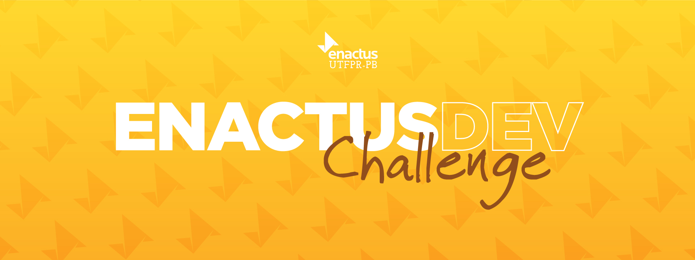

# ENACTUS DEV CHALLENGE

Repositório criado para o <a href="https://docs.google.com/presentation/d/14xh56Jyh1qvZoePe18i9BwH5UJQ2vCcTxfmfJNLnn6M/edit#slide=id.gcb9a0b074_1_0">processo de capacitação</a> desenvolvido pela Enactus UTFPR-PB.

Ao longo do processo, serão realizados projetos com o uso
das principais tecnologias utilizadas no desenvolvimento de aplicações web como: HTML, CSS, JavaScript, ReactJS, NodeJS, entre outras.

# 1 - Desafio HTML e CSS

Desenvolver em HTML e CSS a página inicial de um site de receitas.

## Recursos

Os recursos necessários (Imagens e ícones) estão disponíveis na pasta `Assets`.

Prototipagem: <a href="https://www.figma.com/file/MZIsIkSGY0oX62hk1GEtvJ/Desafios---Enactus-Frontend?t=50oJoRfQOoxjbO9M-6"> Link para o Figma</a>.

## Funcionalidades

O intuito deste projeto é puramente o aprendizado da estrutura e estilização com HTML e CSS. Portanto, não é necessário implementar funcionalidades, como o redirecionamento de botões ou envio de formulários.

# 2 - Desafio JavaScript e TypeScript

Resolver desafios de typescript no <a href="https://www.codewars.com/">CodeWars</a> e criar um clone do jogo <a href="https://term.ooo/">Termo</a> (Ou <a href="https://www.nytimes.com/games/wordle/index.html">Wordle</a>, em sua versão original).

## Recursos:

Nenhum recurso externo é necessário.

## Funcionalidades:

O jogo deve obedecer as seguintes regras:

- Ao iniciar uma partida, selecionar uma palavra de forma aleatória dentro de um array de palavras <strong>(Todas as palavras devem conter 5 letras!)</strong>

- Dada uma palavra selecionada, apresentar 6 tentativas para o usuário adivinhar a palavra correta;

- Ao digitar uma palavra e pressionar `Enter`, o jogo deve verificar se a palavra digitada preenche todos os 5 campos.

- Caso preencha os 5 campos, o jogo deve verificar cada letra de acordo com o padrão a seguir:

  - Se uma letra estiver na posição correta, ficará em verde
  - Se uma letra estiver na posição incorreta, ficará em amarelo
  - Se a letra não existir na palavra original, ficará em tonalidade escurecida

- Caso a palavra esteja correta, uma mensagem de sucesso será exibida. Caso seja a <strong>última tentativa</strong> e a palavra incorreta, uma mensagem de fracasso deverá aparecer. Em ambos os casos, o jogo é reiniciado.

- <strong>OBS: Como o usuário só possui 6 tentativas, uma tentativa não pode ser realizada novamente após sua validação! </strong>

## Material de apoio:

<a href="https://github.com/luiz1303/Termo_clone">https://github.com/luiz1303/Termo_clone</a>

# 3 - Desafio Git e GitHub

Clonar um repositório, criar uma nova branch, realizar as alterações sugeridas e realizar um Pull Request.

## Material de apoio:

<a href="https://github.com/luiz1303/Tutorial_Git">https://github.com/luiz1303/Tutorial_Git</a>

# 4 - Desafio NodeJS e ReactJS

Implementar um Widget de previsão do tempo com ReactJ, em que os dados virão de uma API.

## Material de apoio:

<a href="https://theultimateapichallenge.com/weather-api-react">Desafio Original</a>

<a href="https://www.youtube.com/watch?v=VM4e37DaskU">API com Axios</a>

# 5 - Desafio NextJS

Criar um projeto e integrar as páginas com estrutura de rotas.

## Material de apoio:

<a href="https://www.youtube.com/watch?v=V2T_bkOs0xA">Rotas Dinâmicas com NextJS</a>

# Recomendações de cursos e conteúdos

- <a href="https://www.codecademy.com/catalog">Codecademy</a> (Gratuito)

- <a href="https://www.freecodecamp.org/">FreeCodeCamp</a> (Gratuito)

- <a href="https://www.rocketseat.com.br/discover">Rocketseat</a> (Gratuito)

- <a href="https://www.udemy.com/course/curso-de-javascript-moderno-do-basico-ao-avancado/">Curso Luiz Otávio Miranda</a> ($)

- <a href="https://programador.onebitcode.com/">OneBitCode</a> ($$$) 

- <a href="https://www.w3schools.com//">w3Schools</a> (Gratuito)

- <a href="https://www.origamid.com/">Origamid</a> ($$$$$)

- <a href="https://www.theodinproject.com">The Odin Project</a> (Gratuito)

- <a href="https://www.youtube.com/watch?v=BXqUH86F-kA">Playlist de Javascript</a> (Gratuito)

- <a href="https://www.youtube.com/watch?v=FXqX7oof0I4list=PLnDvRpP8BneyVA0SZ2okm-QBojomniQVO">Playlist de React</a> (Gratuito)
